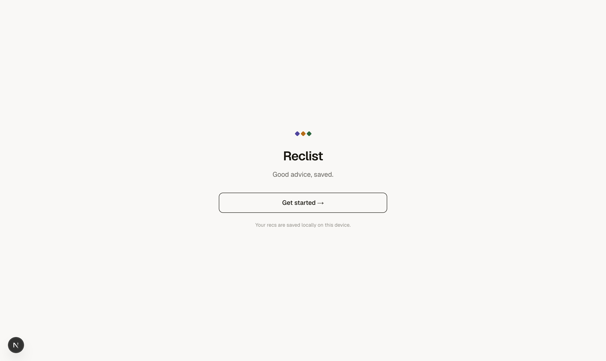
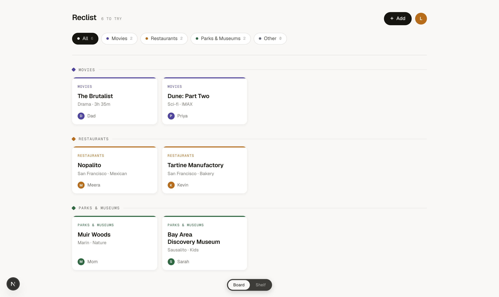
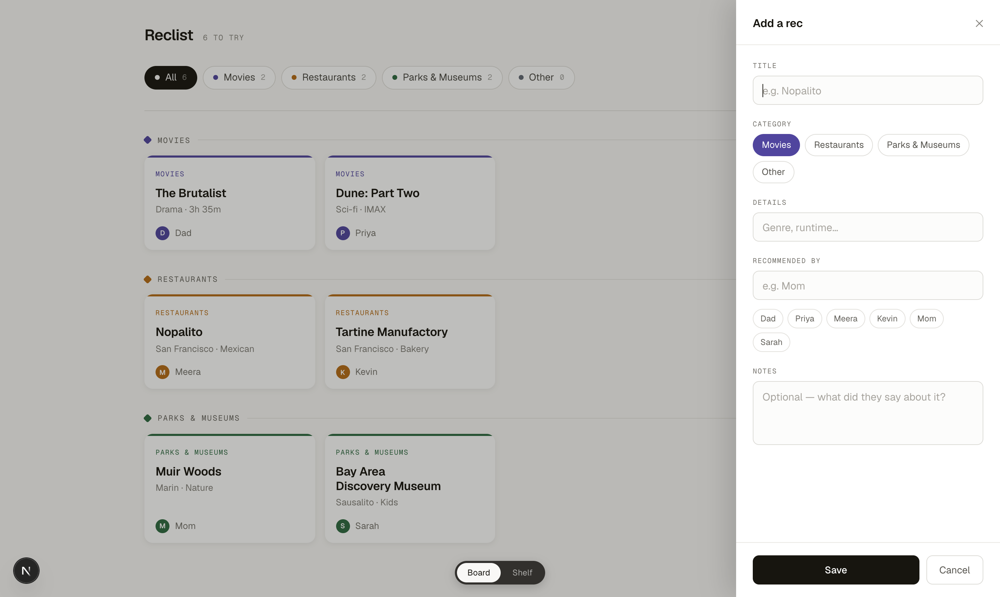
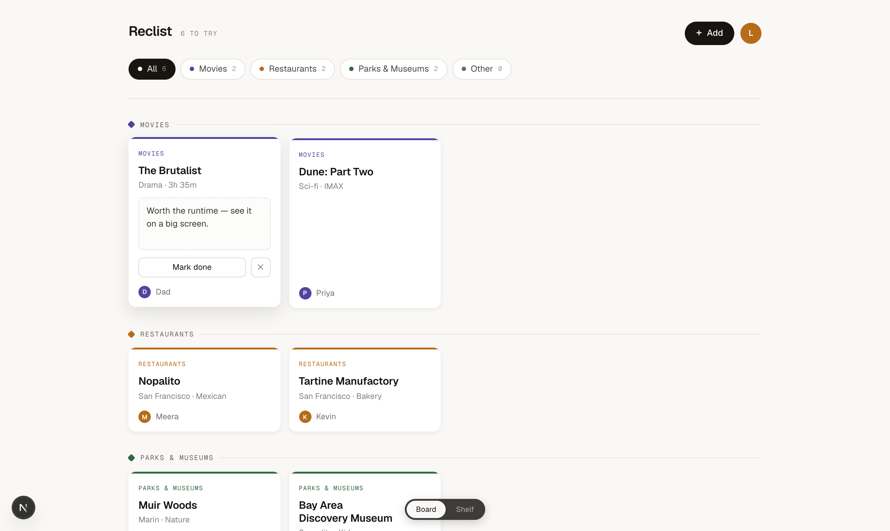
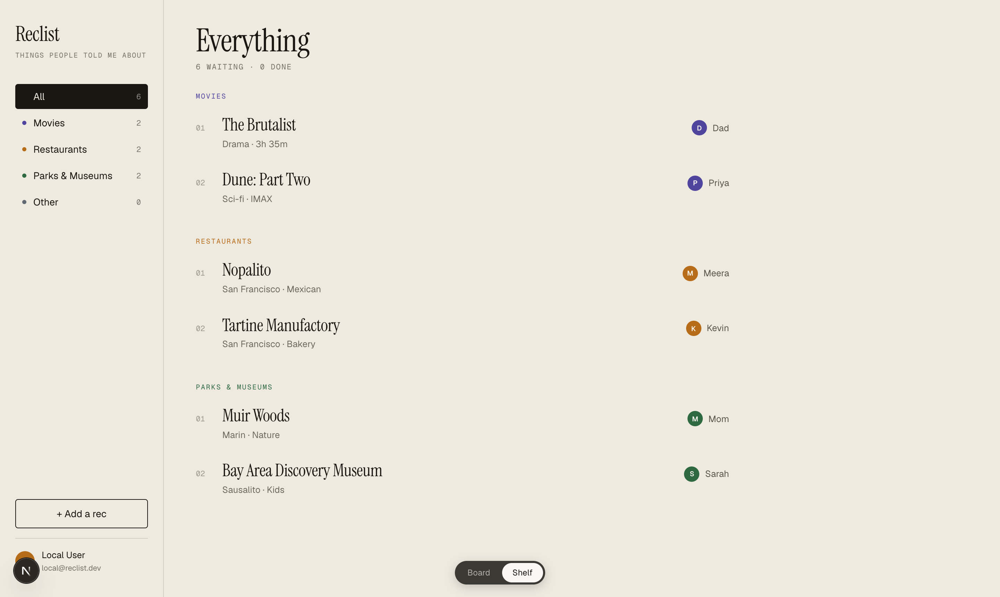

# Reclist

> Good advice, saved.

A personal wishlist for recommendations from family and friends — movies, restaurants, parks, museums, and anything else — all in one place, with who told you.

## Screenshots

### Landing page


### Board view
Cards grouped by category, each showing the recommender. Switch categories with the filter tabs.



### Add a rec
Slide-in panel with quick-pick chips for past recommenders. Details field auto-suggests based on category.



### Expanded card
Click any card to expand it — edit notes, mark done, or delete.



### Shelf view
An editorial alternative to the board. Toggle between views with the floating pill at the bottom.



## Stack

| Layer | Choice |
|---|---|
| Framework | Next.js 16 (App Router) |
| Styling | Tailwind CSS v4 |
| Auth | NextAuth v5 (Google OAuth) |
| Database | SQLite via Drizzle ORM |
| Fonts | Geist · Geist Mono · Instrument Serif |

## Running locally

```bash
npm install
npm run dev
```

Open [http://localhost:3000](http://localhost:3000). Click **Get started →** to use the app without Google sign-in.

To enable Google sign-in, add credentials to `.env.local`:

```
GOOGLE_CLIENT_ID=your-client-id
GOOGLE_CLIENT_SECRET=your-client-secret
NEXTAUTH_SECRET=any-random-string
AUTH_URL=http://localhost:3000
```

Get credentials at [console.cloud.google.com](https://console.cloud.google.com) → APIs & Services → Credentials → OAuth Client ID (Web). Add `http://localhost:3000/api/auth/callback/google` as an authorized redirect URI.

## Docs

- [Problem Definition](docs/Problem%20Definition.md)
- [Design](docs/Design.md)
- [Product · Design · Tech Spec](docs/Reclist%20Spec.html)
